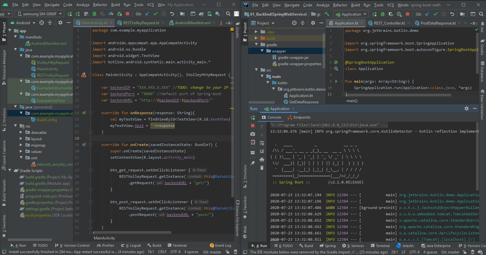
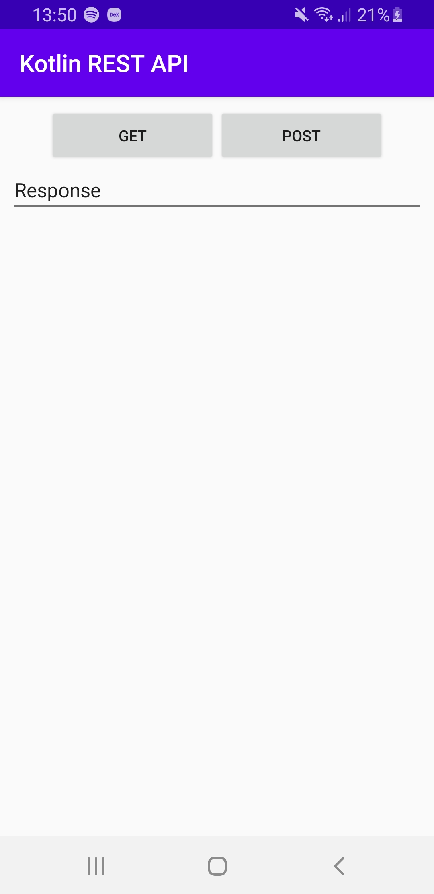
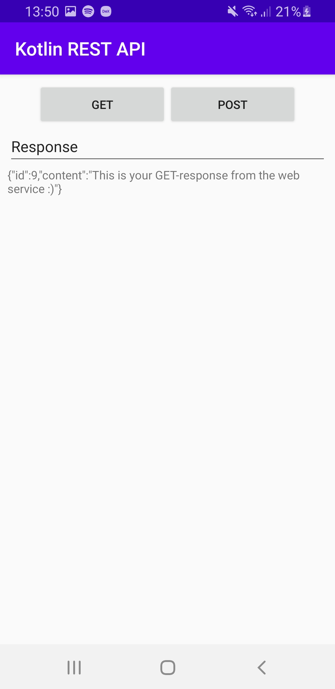
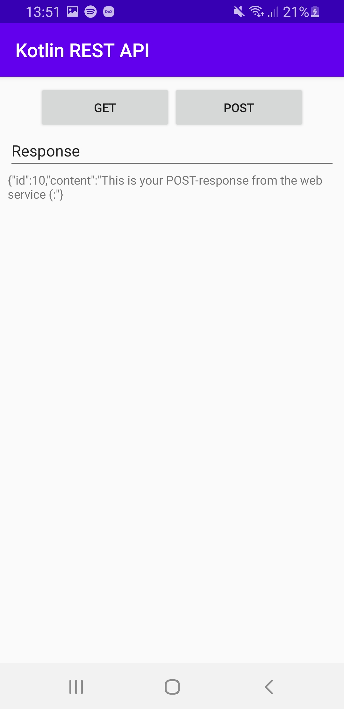

# Kotlin REST API
Kotlin is not only a lot of fun to work with, but also increasingly relevant language. 
In May 2019 Google proclaimed Kotlin to be the preferred language for Android app 
developers. Spring now offers out of the box web service setup for Kotlin. This project
is a playful demonstration of an Android front end with a Spring-Boot back end 
implemented a RESTful web service.

## Prerequisites
Both front end and back end are Gradle-based projects. Any dependancies needed are imported automatically. 

## Execution

Android Studio for front end and IntelliJ for back end are great alternatives to get this demo running.

Note that you will have to either enter the IP address of your back end service if using an external 
device (smartphone) or change the address to *localhost* if using an emulator. This has to be done in two 
files (marked as *TODO* in both):
- \01_BackEnd(SpringWebService)\app\src\main\java\com\example\myapplication\MainActivity.kt
- \02_FrontEnd(AndroidApp)\app\src\main\res\xmlnetwork_security_config.xml 

The front end looks as follows:

On start             |  GET request             |  POST request
:-------------------------:|:-------------------------:|:-------------------------:
 |   |   

## Security
This is a demo project which cannot be claimed to be secure as is. Additional 
information about securing an Android application can be found for example in 
my Medium article 
[Android's Security Concept](https://medium.com/@MaloPavol/androids-security-concept-part-i-3f079755d3e3).  

## License
This project is released under the MIT license.

